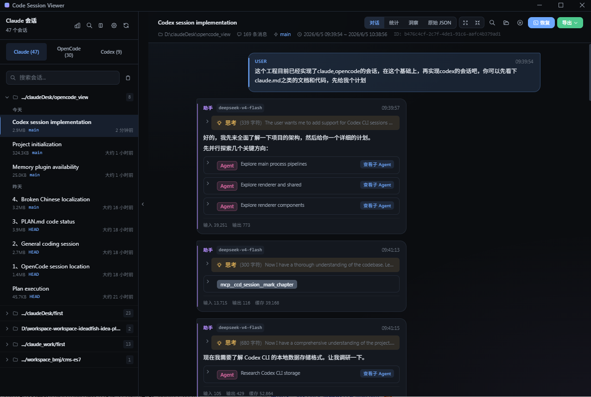
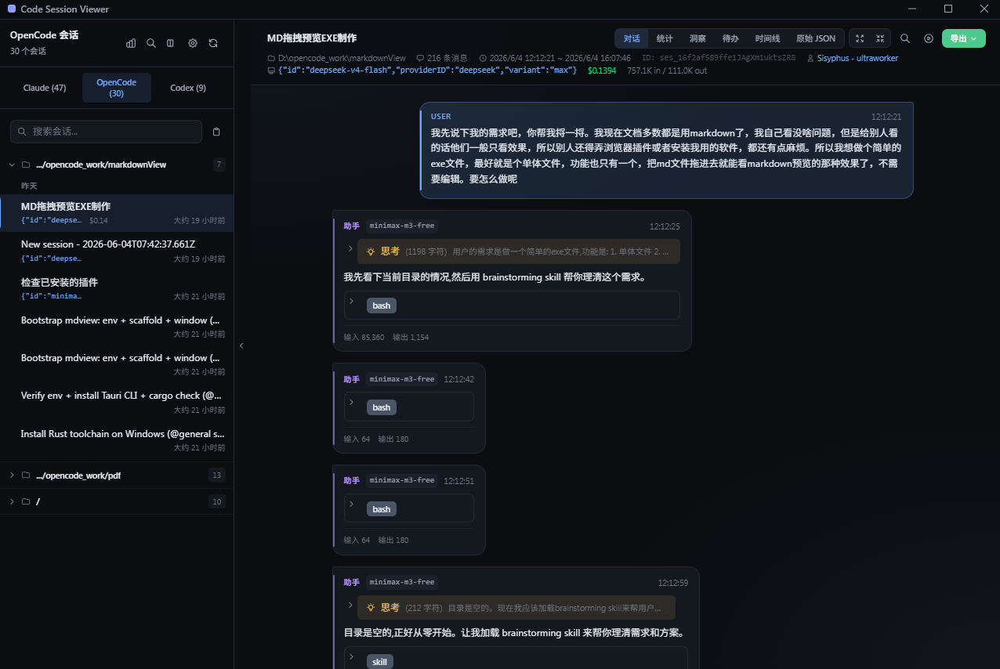
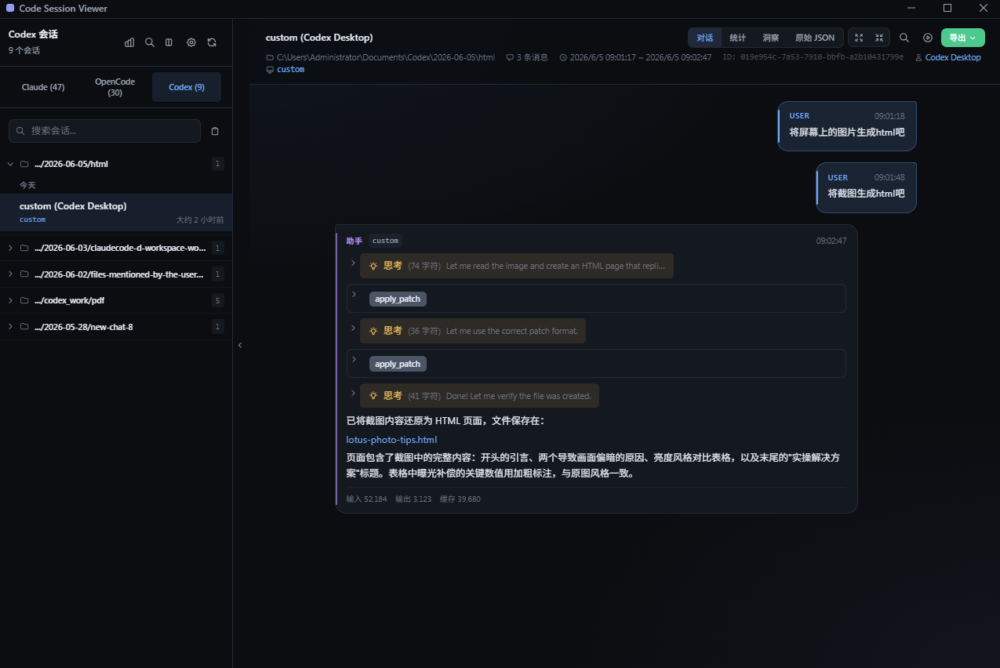
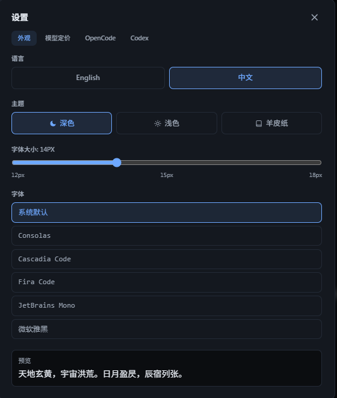
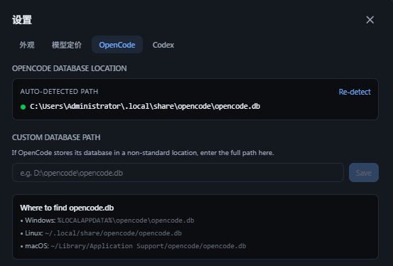
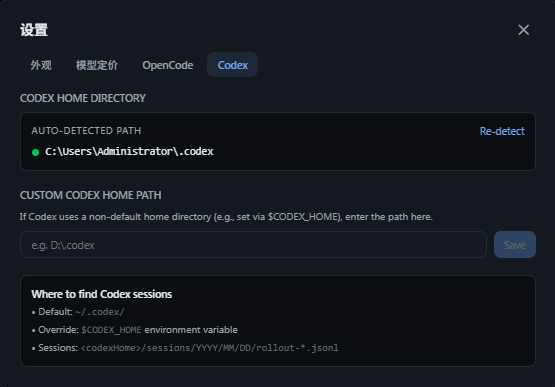

# Code Session Viewer

> **简体中文** · [English](./README.en.md)

[](./LICENSE)
[](https://www.electronjs.org/)
[](https://nodejs.org/)

> **Fork 自** [Lition13/claude-session-viewer](https://github.com/Lition13/claude-session-viewer) —— 在原有 Claude Code 管线基础上增加了 **OpenCode** 和 **Codex CLI** 会话支持。

本项目使用 Claude + DeepSeek + MiMo（为了看截图）实现，目的是熟悉 AI 编程工具的使用，同时也根据自己需要，在原作者的基础上做些修改和扩展。

在 [thought process](./thought process/) 目录里有 1、2、3、4 四个 md 文件，是用本工具导出的对话过程。不知道是连接问题还是什么，每个会话到一定程度就会自动停掉，所以最后开了 4 个会话。第四个会话检查问题耗时很久，起码 40 分钟，比做功能都更耗时。

一个用于浏览、分析和分享 AI 编程会话的 Electron 桌面应用，**支持 Claude Code（JSONL）、OpenCode（SQLite）和 Codex CLI（JSONL）三种数据源**。

> 🔒 **隐私优先** — 本工具完全在本地运行，只读取 `~/.claude/`、`~/.local/share/opencode/` 和 `~/.codex/` 下的本地文件，不上传任何数据，不接入任何分析/埋点服务。源码开放，可自行审计。


## 截图

| | |
|---|---|
|  |  |
|  |  |
|  |  |

## 相对于原版的改动

- **OpenCode 支持** — 读取 OpenCode SQLite 会话，与 Claude Code JSONL 并行
- **Codex CLI 支持** — 读取 OpenAI Codex CLI 的 rollout JSONL 会话文件，支持 Codex Desktop 和 CLI 两种来源
- **国际化 (i18n)** — 完整的 English / 中文 UI 本地化，支持应用内语言切换
- **Todo 列表与 Agent 时间线** — OpenCode 专属面板，用于任务追踪和 agent/模型切换查看
- **自定义模型定价** — 支持添加非 Claude 模型的定价（GPT-4o、DeepSeek 等）

> 📖 完整的功能列表、快捷键、技术栈和项目结构，请参阅[原版 README](https://github.com/Lition13/claude-session-viewer/blob/main/README.md)。

## 快速开始

### 环境要求
- Node.js >= 18
- npm >= 9

### 从源码构建

```bash
git clone https://github.com/yg1987/code-session-viewer.git
cd code-session-viewer

npm install
npm run dev
```

### 生产构建与打包

```bash
npm run build
npm run package
```

## 文档

- [PLAN.md](./PLAN.md) — 架构设计与实现笔记
- [thought process](./thought process/) — 用本工具导出的构建过程对话记录（4 个会话）
- [docs/](./docs/) — 原版项目文档（架构、开发指南、功能说明）— 尚未更新 OpenCode/i18n 相关内容

## 贡献

欢迎 issue 和 PR！本仓库 fork 自 [Lition13/claude-session-viewer](https://github.com/Lition13/claude-session-viewer)，原作者贡献会向上游回馈。

## License

MIT — 见 [LICENSE](./LICENSE)
